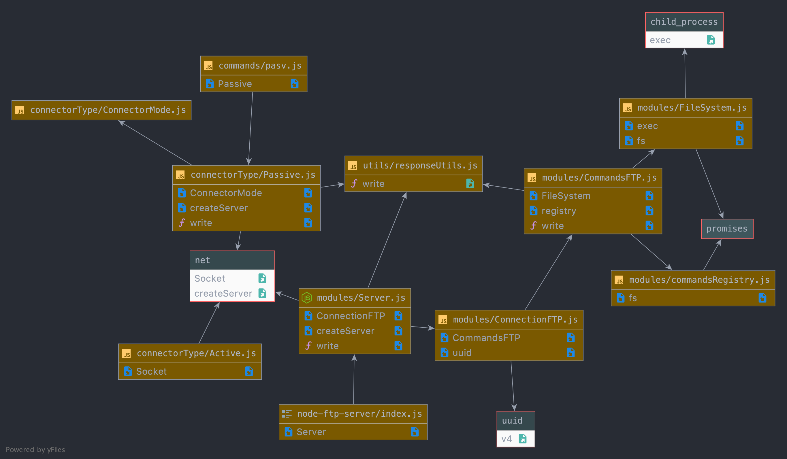

# 💻 Serveur FTP • Nicolas Fernandes & Mickael Gomez • 23/02/2021

Serveur FTP en [Node.js](https://nodejs.org).

## Architecture



### Classes

*TODO*

### Gestion d'erreurs

*TODO*

## Code Samples

```js
import fs from 'fs/promises';

let registry;

try {
    const files = await fs.readdir('commands');
    const modules = new Map(await Promise.all(files.map(async filename => {
        const mod = await import(`../commands/${filename}`);
        return [filename.split('.')[0], mod.default];
    })));
    registry = Object.fromEntries(modules);
    
} catch (error) {
    console.error(error);
}

export default registry;
```
Voici le module commandsRegistry qui permet de créer un objet registry qui contient toutes les implémentations des commandes du repertoires commands.
Grâce à ce bout de code, pour ajouter une nouvelle commande, il suffit d'ajouter un fichier avec la même structure que les autres commandes.<br>

Voici la structure d'une commande :<br>
- commandName : représente le nom de la commande FTP
- handler : c'est la fonction qui contient le code de la commande pour pouvoir l'executer 

```js
export default {
    commandName: 'LIST',
    handler: async ({ socket, message, fs, commands}, write) => {
        let res;
        try {
            res = await fs.list(message);
        } catch (error) {
            res = error;
        }

        socket.write(`150 Here comes the directory listing.\r\n`);
        await commands.connector.dataSocket.write(res);
        await commands.connector.destroyDataSocket();
        await write(socket, "226 Transfer complete.");
    }
}
```

## Installation & Exécution

Avant d'éxécuter le serveur veuillez renseigner le port (21 par défaut) et le répertoire racine du serveur FTP
Exécuter la commande suivante permet d'installer toutes les dépences nécessaires :

```bash
npm install
```

Puis pour lancer le serveur :

```bash
npm run start
```

## Documentation

La documentation est disponible dans ```/docs``` et couvre l'essentiel du fonctionnement de l'application.